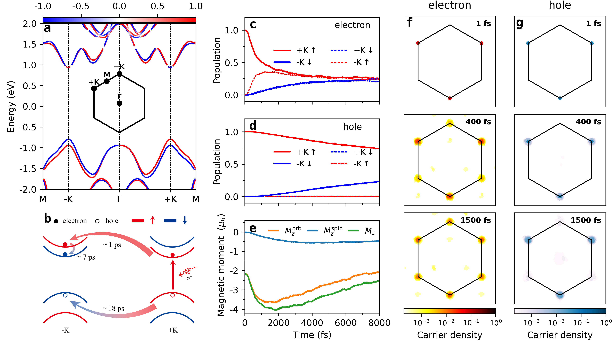
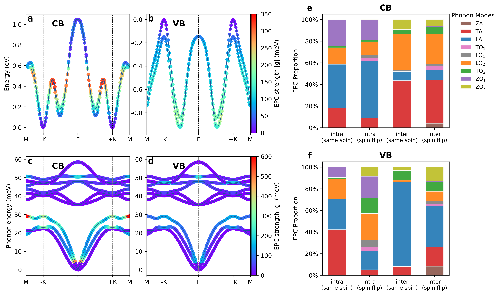
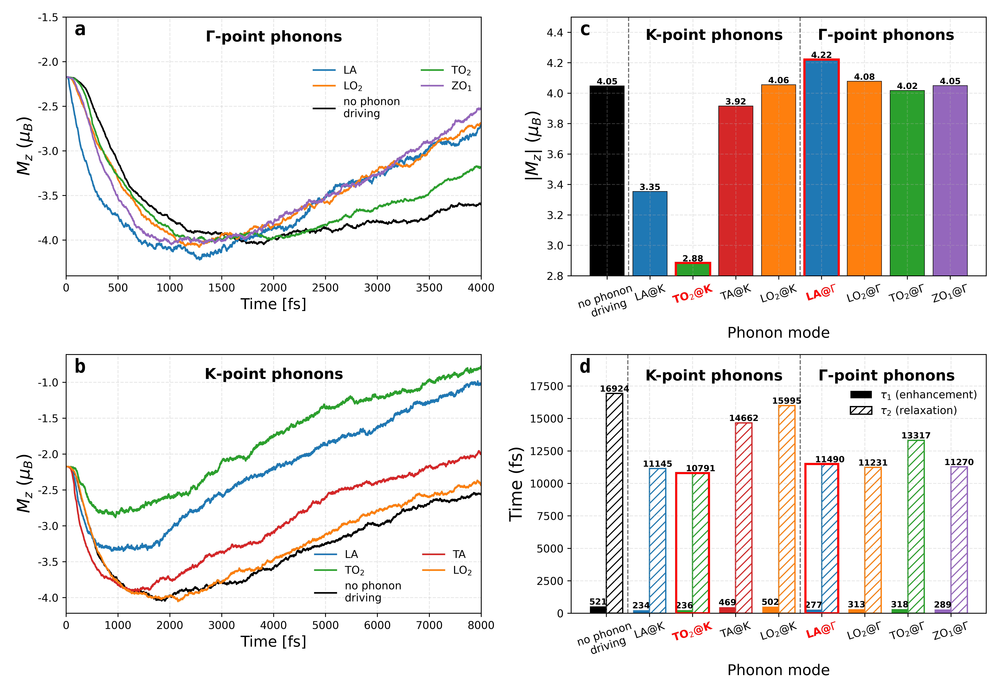
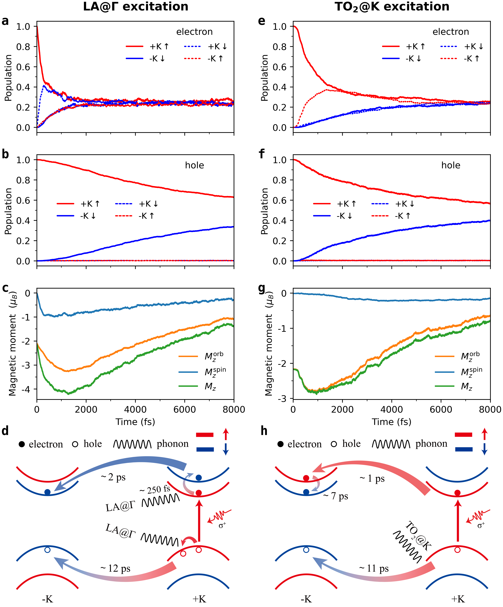

# Dataset Directory Description

This dataset contains files for MoS2 NAMD carrier dynamics calculations and the related data used for figure preparation. The directory contents are organized as follows:

| Directory | Description |
| --- | --- |
| `code_namdk/` | Source code for NAMD-K/NAMD, including example inputs, scripts, and source files. |
| `electron/` | Electronic-structure calculations, including structural calculation, self-consistent-field calculation, non-self-consistent-field calculation, band-structure calculation, and Wannier interpolation. |
| `phonon/` | Phonon calculation files. |
| `epc/` | Electron-phonon coupling calculations and interpolation calculations. |
| `namd/` | NAMD carrier dynamics calculations, including electron and hole dynamics. |
| `figs_data_scripts/` | Raw data, original figures, and post-processing scripts used for the main-text figures. |

## Figures

### Figure 1

### Figure 2

### Figure 3

### Figure 4

## Note

The electron-phonon coupling data files are too large and are therefore not included in this dataset.

---

# 数据目录说明

本数据集用于 MoS2 体系的 NAMD 载流子动力学相关计算与作图数据整理。各目录内容如下：

| 目录 | 内容说明 |
| --- | --- |
| `code_namdk/` | NAMD-K/NAMD 相关源代码，包含输入示例、脚本和源程序。 |
| `electron/` | 电子结构相关计算，包括结构计算、自洽计算、非自洽计算、能带计算和 Wannier 插值计算。 |
| `phonon/` | 声子计算相关文件。 |
| `epc/` | 电声耦合计算及插值计算相关数据和脚本。 |
| `namd/` | NAMD 载流子动力学计算数据，包含电子和空穴动力学计算。 |
| `figs_data_scripts/` | 正文图像相关内容，包括原始数据、原始图像以及后处理脚本。 |

## 备注

电声耦合数据文件体积较大，因此未包含在本数据集中。
